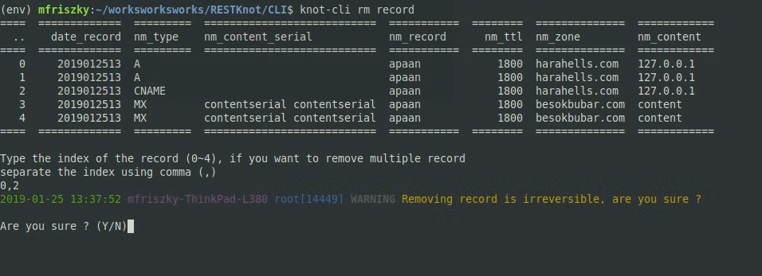
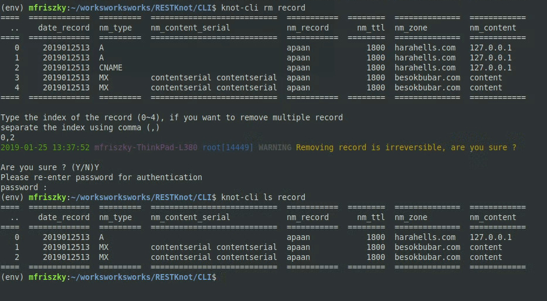

# knot-cli


Command Line Interface for Restknot


## What is knot-cli


Knot-cli is a command line interface to operate RESTKnot


## Usage

List of available command on knot-cli

#### Create
```
create dns (--nm=NAME) [-i]
create record
create record (--nm NAME) (--nm-zn ZONENAME) (--type=TYPE) (--ttl TTL) (--nm-con CON) [--nm-con-ser CONSER] 
create record -f FILENAME
```

Options : 
```
-h --help                 Print usage
--nm NAME                 Set DNS/record name
-type=TYPE                Set DNS type
--ttl TTL                 Set DNS TTL 
--nm-zn ZONENAME          Set zone of new record
-i --interactive          Interactive Mode
--nm-con CON              Set content name
--nm-con-ser CONSER       Set content serial name
-f FILENAME               Create Record using YAML
```

#### List

```
ls ttl
ls type
ls record [--nm NAME]
ls dns
```

Options : 

```
--nm                        Show list of selected zone

```

#### Remove
```
rm dns (--nm NAME)
rm record [(--nm-zone=ZNNAME [--nm-record=NAME] [--type=TYPE] )]

```

<a name="Filter"></a>Options : 
```
-h --help               Print usage
--nm=NAME               DNS' name to delete
--nm-record=NAME        Filter record by record's name
--nm-zn=ZNNAME          Filter record by zone's name
```

### Login and Account
Knot-cli requires you to create an account on [portal-neo](https://portal.neo.id/). Note that before using knot-cli you have to login using

```
login
```
```
logout [-r]
```

use logout -r to remove all your data for fresh login in the future


### Creating Zone and Record

To create a new zone and records, use the following commands respectively 

### Zone
```
create dns (--nm=NAME)

Options : 
    --nm NAME                 Set DNS/record name
```

### Record

Use following commands for creating records
```
create record
```

Or if you want to manually input your record's details
```
create record (--nm NAME) (--nm-zn ZONENAME) (--type=TYPE) (--ttl TTL) (--nm-con) [--nm-con-ser CONSER]
```
```
    -type=TYPE                Set DNS type
    --ttl TTL                 Set DNS TTL 
    --nm-zn ZONENAME          Set zone of new record
    --nm-con CON              Set content name
    --nm-con-ser CONSER       Set content serial name
```
You can also create records from yaml. 

```
create record -f FILENAME
```

#### Creating Record  from YAML File

Place your yaml file in
```
~/restknot
```

and follow this format
```yaml

"zone_name":
    "record_name_1":
        - "record_type1":
            "ttl" : "ttl_value"
            "content_name" : "content_value"
        - "record_type2":
            "ttl" : "ttl_value"
            "content_name" : "content_value"
            "content_serial" : "content_serial_value"
    "record_name_2":
        - "record_type":
            "ttl" : "ttl_value"
            .
            ...
"other_zone":
    "record_name_1":
        - "record_type2":
            .
            ...

```

See [create.yaml](https://raw.githubusercontent.com/BiznetGIO/RESTKnot/master/CLI/example/create.yaml) for further information


Remember to check available type and ttl before creating records, also MX and SRV record need serial content on creation. For further information on record  type, see [documentation](https://github.com/BiznetGIO/RESTKnot/blob/master/API/docs/markdown/documentation/RULES.md) 


```
ls ttl
ls type
```


### Removing Zone and Record

```
rm dns (--nm NAME)
rm record [(--nm-zone=ZNNAME [--nm-record=NAME] [--type=TYPE] )]
```

When you're removing dns, knot-cli will give you a list of records that will also be removed and ask your confirmation.

On record removal, knot-cli will give you a list of your record based on filter (or all of your record if no filter is given). 



Enter index of the record that you want to remove, then knot-cli will ask for your confirmation.




