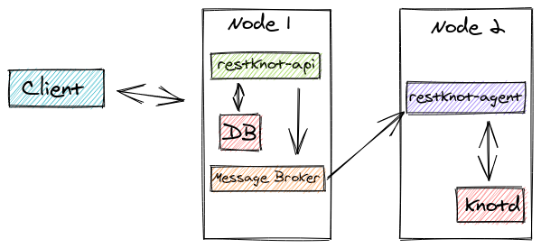

Deployment Steps
================

The complete steps of the deployment process available as Ansible playbooks in ``docs/examples``.

Prepare the production image
----------------------------

``restknot-api`` needs a ``config.yml`` file to run. You can supply the file
outside the image using docker volume. Or build the new image containing your
production version of ``config.yml``.

.. code-block:: bash

    # Dockerfile

    FROM biznetgio/restknot-api:latest

    COPY config.yml /restknotapi

Prepare the required files
--------------------------

Before running the playbooks you have to create a folder named ``configs`` with
the required files. Namely the ``docker-compose.yml`` for both restknot-agent
and restknot-api, ``schema.sql``, and the ``knot.conf`` for both master and
slave files. All of them available in the example directory.
Modify the value of those files to match your production environment.

- ``config.yml`` holds application configurations, mainly a list of Knot servers and a list of Kafka brokers.
- ``knot.conf`` serves as a configuration for the Knot DNS server.
- ``schema.sql`` used to define the DB schema.
- (Optional) ``kowl.yml`` file for Kafka viewer.

The most important thing you have to pay attention to is ``RESTKNOT_AGENT_TYPE``,
it will not work if you set it to ``slave`` but the app runs on the ``master`` node.

Get the keys of your machines
-----------------------------

- Put the key of your machine in one directory .e.g `~/ssh-keys/`
- Point the ansible to those keys .e.g

.. code-block:: yaml

   all:
     vars:
       ansible_private_key_file: "~/ssh-keys/vm-key.pem"

Play the Playbook
-----------------

.. code-block:: console

  $ # initial setup for machine
  $ ansible-playbook initial-setups.yml -f 10 -v

  $ # prepare the machine for restknot-api
  $ ansible-playbook setup-api.yml -f 10 -v

  $ # prepare the machine for restknot-agent
  $ ansible-playbook setup-agent.yml -f 10 -v

Basic Deployment Architecture
-----------------------------

   A basic deployment architecture.

There are many possible forms in the deployment. But the most basic is using a
two-node. The first node is going to host ``restknot-api``,
``database``, and ``message broker``. The second node is hosting ``Knot DNS server
(knotd)`` and ``restknot-agent``.

The three components in the first node can be run using a docker container. You
can use the ``api/docker-compose.example.yml`` as a starting point. For the
second node, it's advised that you install the ``knot server`` locally, then you
can use ``agent/docker-compose.example.yml`` for the ``agent``.
